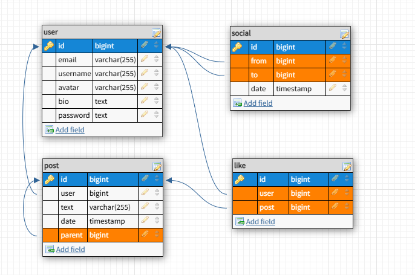

# API RESTful Fast

Este projeto apresenta a implementação de uma aplicação web com API baseada em [FastAPI](https://fastapi.tiangolo.com/). O objetivo é criar um sistema de microblog estilo Twitter, denominado **Pamps**, com funcionalidades essenciais para exercitar os principais recursos de uma API RESTful. **Toda a aplicação é executada em containers Docker, garantindo um ambiente isolado e fácil de replicar.**

## **Principais Funcionalidades**

### **Usuários**
- Registro de novos usuários.
- Autenticação de usuários via JWT.
- Seguir outros usuários.
- Perfil de usuário com bio, listagem de posts, seguidores e seguidos.

### **Postagens**
- Criação, edição e remoção de posts.
- Listagem de posts geral (home) e filtrada (timeline).
- Likes em postagens.
- Respostas a postagens.

---

## **Estrutura de Pastas e Arquivos**

```
.
├── docker-compose.yaml        # Orquestração de containers
├── Dockerfile.dev             # Dockerfile para ambiente de desenvolvimento
├── requirements-dev.txt       # Dependências de desenvolvimento
├── requirements.in            # Dependências de produção
├── MANIFEST.in                # Arquivos incluídos na aplicação
├── .secrets.toml              # Configurações sensíveis (local)
├── settings.toml              # Configurações locais
├── setup.py                   # Instalação da aplicação
├── test.sh                    # Pipeline de testes
├── pamps                      # Diretório principal da aplicação
│   ├── __init__.py            # Inicialização do módulo
│   ├── app.py                 # Definição principal do FastAPI
│   ├── auth.py                # Lógica de autenticação JWT
│   ├── cli.py                 # Comandos CLI (ex: criar usuários, resetar DB)
│   ├── config.py              # Carregamento de configurações
│   ├── db.py                  # Conexão com o banco de dados
│   ├── security.py            # Validação de senhas e hashes
│   ├── models                 # Definições de modelos e serializers
│   │   ├── __init__.py
│   │   ├── post.py            # Modelo de posts
│   │   └── user.py            # Modelo de usuários e relacionamento
│   ├── routes                 # Definição das rotas da API
│       ├── __init__.py
│       ├── auth.py            # Rotas de autenticação
│       ├── post.py            # Rotas de CRUD para posts
│       └── user.py            # Rotas de CRUD para usuários
├── postgres                   # Scripts para configuração do banco de dados
│   ├── create-databases.sh    # Criação inicial de bancos de dados
│   └── Dockerfile             # Dockerfile do PostgreSQL
└── tests                      # Testes automatizados com Pytest
    ├── __init__.py
    ├── conftest.py            # Configurações globais do Pytest
    └── test_api.py            # Testes das rotas da API
```

---

## **Configuração Inicial**

### **Requisitos**
- Python >= 3.10
- Docker e Docker Compose
- Um editor de código (ex: VSCode, Vim, etc.)

### **Setup Local**
1. Clone o repositório:
   ```bash
   git clone https://github.com/rochacbruno/fastapi-workshop.git
   cd fastapi-workshop
   ```
2. Crie um ambiente virtual e ative:
   ```bash
   python -m venv .venv
   source .venv/bin/activate  # Linux/Mac
   .\.venv\Scripts\activate  # Windows
   ```
3. Instale as dependências:
   ```bash
   pip install --upgrade pip
   pip install -r requirements-dev.txt
   ```
4. Configure o banco de dados e execute as migrações:
   ```bash
   docker compose up -d
   docker compose exec api alembic upgrade head
   ```
5. Inicie a aplicação:
   ```bash
   docker compose up
   ```

Acesse a documentação da API: [http://localhost:8000/docs](http://localhost:8000/docs)

---

## **Banco de Dados**

A aplicação utiliza PostgreSQL como banco de dados principal, com as tabelas principais sendo:



Os scripts de migração são gerenciados com [Alembic](https://alembic.sqlalchemy.org/), garantindo consistência no esquema do banco.

---

## **Principais Endpoints**

### **Autenticação**
- `POST /token`: Obter token de acesso.
- `POST /refresh_token`: Obter um novo token de acesso.

### **Usuários**
- `POST /user/`: Criar um novo usuário.
- `GET /user/`: Listar todos os usuários.
- `GET /user/{username}/`: Detalhes de um usuário.

### **Postagens**
- `POST /post/`: Criar uma nova postagem (autenticação necessária).
- `GET /post/`: Listar todas as postagens.
- `GET /post/{id}/`: Detalhes de uma postagem, incluindo respostas.
- `GET /post/user/{username}/`: Listar postagens de um usuário.

---

## **Testes Automatizados**
Os testes automatizados são realizados com o [Pytest](https://pytest.org/):

1. Inicie o ambiente:
   ```bash
   ./test.sh
   ```
2. Os testes verificam as funcionalidades principais, como:
   - Criação de usuários e autenticação.
   - Publicação e resposta de posts.
   - Listagem e detalhamento de postagens.

---

